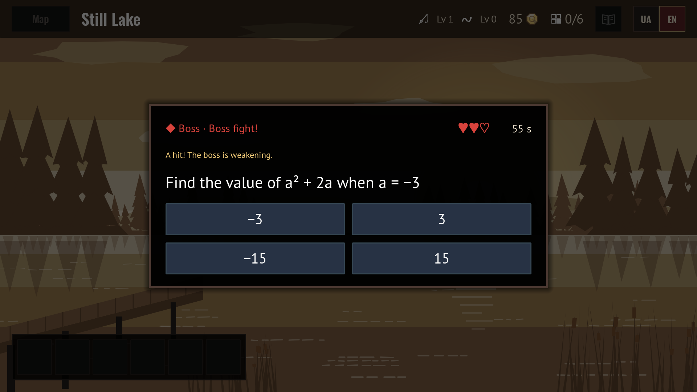
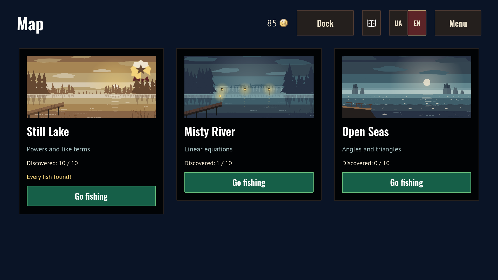
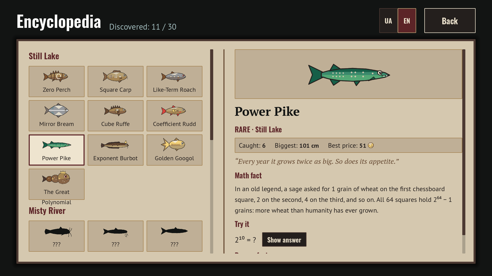

# Time Go Fishing 🎣

**Time Go Fishing** — a math fishing game for 7th graders. Solve a problem to land the fish!

Ukrainian (default) and English.

## Note regarding AI usage

This project was made to show that anyone can make education more accessible and fun, regardless of their knowledge and resources.
The whole game was built using Claude AI, not a single line of code written by human.
Some may call it "AI Slop", and while it may be true, is it necessarily a bad thing if it helps to bring quality education to everyone?

## About

Cast your line, and when a fish bites, solve a math problem to reel it in. Rarer fish

bring harder problems. Sell your catch at the dock, upgrade your rod, bait and hold,

and fill the Encyclopedia with fish and real math history.

- **3 zones, 3 topics:** Still Lake (powers and like terms), Misty River (linear

&#x20; equations), Open Seas (angles and triangles)

- **30 fish species**, each with an Encyclopedia page, a math fact and a "Try it" question

- **Boss fights:** catch every other species in a zone, then beat its boss to reach the next zone

- **135 hand-written problems.** Every wrong answer shows the correct one with a short solution

- Built with [Godot 4.7](https://godotengine.org) for Windows, macOS, Linux and the web

 

## Play

**Download:** grab the zip for your system from [Releases](../../releases/latest),

unzip it and run the game. Nothing needs installing.

**In the browser:** https://viakhdan.github.io/time-go-fishing/

| System | Notes |

|---|---|

| Windows | If SmartScreen warns you, click *More info → Run anyway*. |

| macOS | The app isn't notarized: right-click it and choose *Open* the first time. |

| Linux | Make the file executable (`chmod +x TimeGoFishing.x86\_64`) and run it. |

**Controls:** the mouse for everything; **Space / Enter** to reel in.

Progress saves automatically. To start over, use *Reset progress* in the main menu.

## Build it yourself

1. Install [Godot 4.7.2](https://godotengine.org/download/archive/4.7.2-stable/) (the standard version, not .NET).

2. Clone or download this repository and open `project.godot` in Godot.

3. Press **F5** to play.

To make your own build, install the export templates

(*Editor → Manage Export Templates → Download and Install*), then use

*Project → Export* and pick Windows, Linux, macOS or Web. The presets are already set up.

Or build all four at once with Python 3 (on macOS/Linux, set `GODOT` to your Godot path first):

&#x20;   python tools/export\_all.py

The zips appear in `build/itch/`.

## For developers

- Game data (fish, zones, upgrades, prices) lives in `data/\*.json`; problems in `data/problems/`.

- All text is in `i18n/strings.csv` (Ukrainian and English).

- Checks: `python tools/validate\_problems.py` (computes every answer),

&#x20; `python tools/validate\_data.py`, `python tools/run\_tests.py` (needs `pip install -r tools/requirements.txt`).

- Design notes: [Docs/DESIGN.md](Docs/DESIGN.md) · art style: [Docs/ART\_STYLE.md](Docs/ART\_STYLE.md)

## Credits

- Made by Danylo Viakhiriev with Claude Opus 5.5 (Anthropic)

- Fonts: Oswald, PT Sans, PT Serif, Noto Sans, Noto Sans Math (SIL Open Font License)

- Engine: [Godot](https://godotengine.org) (MIT)

- The visual style was inspired by *DREDGE* (Black Salt Games); no assets from it are used.

## License

Code: [MIT](LICENSE) · Art and texts: [CC BY 4.0](LICENSE-ASSETS.md) · Fonts: SIL OFL 1.1

